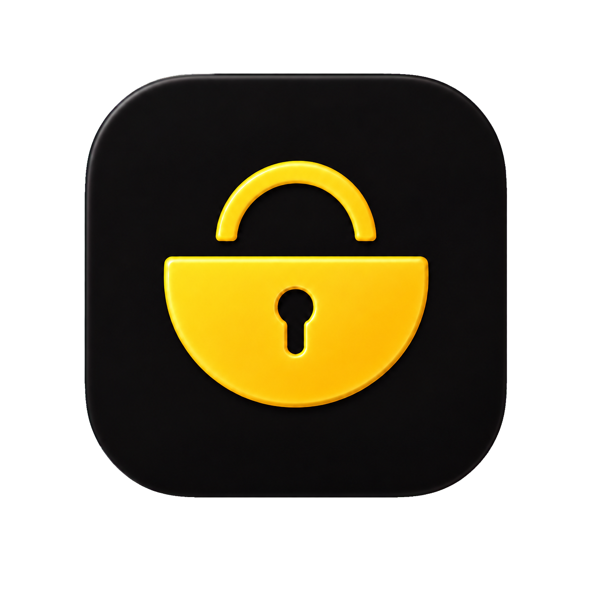

# PocketPass｜口袋密码

<p align="center">
  
</p>

<p align="center">本地优先、原生 SwiftUI 实现的 macOS 账户密码管理器。</p>

> 当前版本：**V1.0(1)**<br>
> 系统要求：**macOS 26 或更高版本**<br>
> 支持架构：**Apple Silicon 与 Intel（Universal Binary）**

## 产品定位

PocketPass（中文品牌名“口袋密码”）用于在 Mac 本地集中整理网站、应用和服务的登录信息。应用不会读取 macOS 钥匙串，也不会在当前版本中连接 iCloud；首次启动只提供默认分类，不包含任何演示账户、密码或其他测试数据。

## 已实现功能

- **本地加密存储**：账户、密码、分类、标签和附件写入 AES-GCM 加密密码库。
- **多登录账号**：一个账户项目可以包含多个登录账号，每个账号拥有独立用户名、密码和自定义字段。
- **灵活字段**：提供账号、密码、手机号、邮箱、ID、昵称、注册时间、网址等常用模板，也可创建任意字段。
- **分类和标签**：支持自定义分类名称、图标、颜色，以及可被多个账户复用的标签。
- **图标来源**：支持内置单色图标、9 个常用地区的 App Store 搜索、网站 favicon 和本地相册图片。
- **图片附件**：账户项目可保存有限数量的本地图片附件。
- **应用锁**：支持 Touch ID 或 macOS 设备密码解锁，可设置立即或延时自动锁定。
- **回收站**：删除数据保留 30 天，也可立即永久删除或恢复。
- **数据迁移**：支持 `.pocketpass` 加密备份及 JSON、CSV、Markdown 导入导出。
- **重复校验**：相同 ID 按修改时间合并，内容完全相同的账户会跳过，避免重复导入。
- **过程反馈**：导入和导出显示进度、处理数量及结果统计。
- **搜索与排序**：支持按账户、网址、标签及字段内容搜索，并可按名称、分类或最近修改排序。
- **双语界面**：原生支持简体中文与 English，可在设置中即时切换并记住选择。

## 产品特点

### 本地优先

V1.0(1) 不接入云端服务。密码库保存在当前用户的：

```text
~/Library/Application Support/口袋密码/
```

数据库内容使用 AES-GCM 加密。本地加密密钥保存在同一应用数据目录中、文件权限仅限当前用户读取；应用不会读取系统钥匙串。

### 原生体验

应用使用 Swift 与 SwiftUI 开发，界面、Touch ID/设备密码验证、文件选择和系统图标均采用 macOS 原生能力。

### 可迁移数据

加密备份适合完整迁移；JSON、CSV 和 Markdown 方便用户检查、整理或与其他工具交换数据。请注意：JSON、CSV 和 Markdown 导出包含明文密码，需妥善保管。

## 下载与安装

1. 在 [Releases](../../releases) 下载 `PocketPass-2026081501.dmg`。
2. 打开 DMG，将“口袋密码”拖入 **Applications** 文件夹。
3. 从“应用程序”目录启动口袋密码。

### 首次打开提示

当前版本使用临时签名，尚未经过 Apple Developer ID 签名及公证。若 macOS 阻止首次打开：

1. 在“应用程序”中右键“口袋密码”，选择“打开”；或
2. 前往“系统设置 → 隐私与安全性”，找到拦截提示并选择“仍要打开”。

仅应从本仓库的正式 Release 下载软件，并可使用发布页提供的 SHA-256 校验值验证文件。

## 本地构建

要求安装 Xcode 及 macOS 26 SDK：

```bash
swift run PocketPass
```

构建正式 Universal App 和 DMG：

```bash
./Scripts/build-release.sh
```

生成文件位于：

```text
dist/PocketPass-2026081501.dmg
```

## 隐私与安全说明

- 应用不会主动读取 macOS 钥匙串中的任何信息。
- V1.0(1) 不上传密码库，也不包含分析、广告或跟踪 SDK。
- 应用锁用于阻止他人在应用界面中查看数据，不代替磁盘加密或 macOS 用户账户安全。
- 设备损坏或应用数据目录丢失可能造成数据无法恢复，请定期创建 `.pocketpass` 加密备份。
- 本项目尚未接受独立安全审计，不建议在未评估风险的情况下用于高价值生产凭据。

## 后续开发路线

### V1.x

- 密码生成器与密码强度检查。
- 重复、弱密码和过期凭据检查。
- 更完整的批量导入、冲突处理及备份管理。
- Developer ID 签名、公证和自动更新能力。
- 无障碍、键盘操作和性能优化。

### V2.0

- 在具备 Apple Developer 账户和 CloudKit 能力后，提供端到端加密的 iCloud 同步。
- 使用“最后修改时间较新版本优先”的冲突策略，并提供冲突记录。
- iPhone 与 iPad 原生客户端，共用兼容的数据结构。

### 后续目标

- Safari、Chrome、Edge、Firefox 扩展。
- 系统密码自动填充与登录后保存。
- 跨设备共享、紧急访问及更细粒度的安全策略。

## 当前暂不包含

- iCloud 同步。
- iOS / iPadOS 客户端。
- 浏览器扩展及网页自动填充。
- 密码生成器。

## 使用范围

本仓库为个人私有项目，仅供仓库所有者个人使用。未经授权，不得公开、复制、修改或再分发项目源代码及发布文件。
